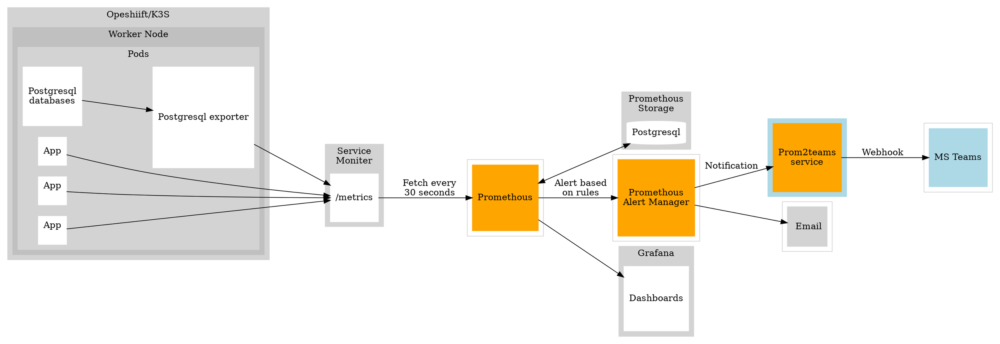

# Prom2teams Helm Chart

Prometheus Alertmanager/Microsoft Teams integration

## Introduction

[Prom2teams](https://github.com/idealista/prom2teams#helm-chart) is a service built with Python that receives alert notifications from a previously configured [Prometheus Alertmanager](https://github.com/prometheus/alertmanager) instance and forwards it to [Microsoft Teams](https://teams.microsoft.com/) using defined connectors.

It presents grouping of alerts, labels/annotations exclusion and a Teams' alert retry policy among its key features.

### Steps to create end to end solution:

- Create new teams webhook and copy the link.
- Create Prometheus alert rules.
- Add alert conditions to Alert manager with newly created webhook.
- Create `prom2teams` service to send notification from `Prometheus` to `Teams`.




## Installing the Chart

```bash
# View repo list
sudo helm repo list

# Update chart version
sudo helm repo update
```

```bash
export name="";
export namespace="";
export connector="";
sudo helm upgrade --install --name ${name} Prom2teams-helm-chart -n ${namespace} --set prom2teams.connector=${connector}
```

After a few seconds, Prom2Teams should be running.

## Uninstalling the Chart

```bash
helm delete ${name}  -n ${namespace}
```

### Configuration

The following table lists the configurable parameters of the Prom2teams chart and their default values.

| Parameter                                       | Description                                                                                                        | Default
| ---                                             | ---                                                                                                                | ---
| `image.repository`                              | The image repository to pull from                                                                                  | `idealista/prom2teams`
| `image.tag`                                     | The image tag to pull                                                                                              | `<empty>`
| `image.pullPolicy`                              | The image pull policy                                                                                              | `IfNotPresent`
| `resources.requests.cpu`                        | CPU requested for being run in a node                                                                              | `100m`
| `resources.requests.memory`                     | Memory requested for being run in a node                                                                           | `128Mi`
| `resources.limits.cpu`                          | CPU limit                                                                                                          | `200m`
| `resources.limits.memory`                       | Memory limit                                                                                                       | `200Mi`
| `service.type`                                  | Service Map (NodePort/ClusterIP)                                                                                   | `ClusterIP`
| `service.port`                                  | Service Port                                                                                                       | `8089`
| `prom2teams.host`                               | IP to bind to                                                                                                      | `0.0.0.0`
| `prom2teams.port`                               | Port to bind to                                                                                                    | `8089`
| `prom2teams.connector`                          | Connector URL                                                                                                      | `<empty>`
| `prom2teams.connectors`                         | A map where the keys are the connector names and the values are the connector webhook urls                         | `{}`
| `prom2teams.group_alerts_by`                    | Group_alerts_by field                                                                                              | `<empty>`
| `prom2teams.loglevel`                           | Loglevel                                                                                                           | `INFO`
| `prom2teams.templatepath`                       | Custom Template path (files/teams.j2)                                                                              | `/opt/prom2teams/helmconfig/teams.j2`
| `prom2teams.config`                             | Config (specific to Helm)                                                                                          | `/opt/prom2teams/helmconfig/config.ini`
| `prom2teams.extraEnv`                           | Dictionary of arbitrary additional environment variables for deployment (eg. `HTTP_PROXY`)                         | `<empty>`

### Configuring Prometheus

The [webhook receiver](https://prometheus.io/docs/alerting/configuration/#<webhook_config>) in Prometheus allows configuring a prom2teams server.

The url is formed by the host and port defined in the previous step.

**Note:** In order to keep compatibility with previous versions, v2.0 keep attending the default connector ("Connector") in the endpoint 0.0.0.0:8089. This will be removed in future versions.   

```bash
// The prom2teams endpoint to send HTTP POST requests to.
url: http://${service-name}:8089/v2/<Connector1>
```

#### Note

Alertmanager does not support Teams out of the box. So we must use webhooks to achieve this. The webhook is used by `prom2teams` to write messages.
